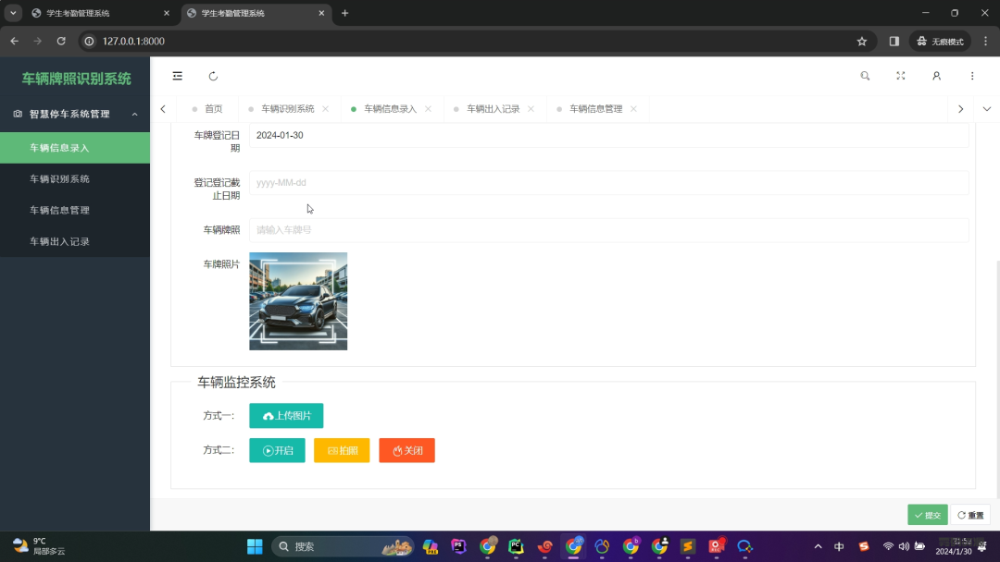
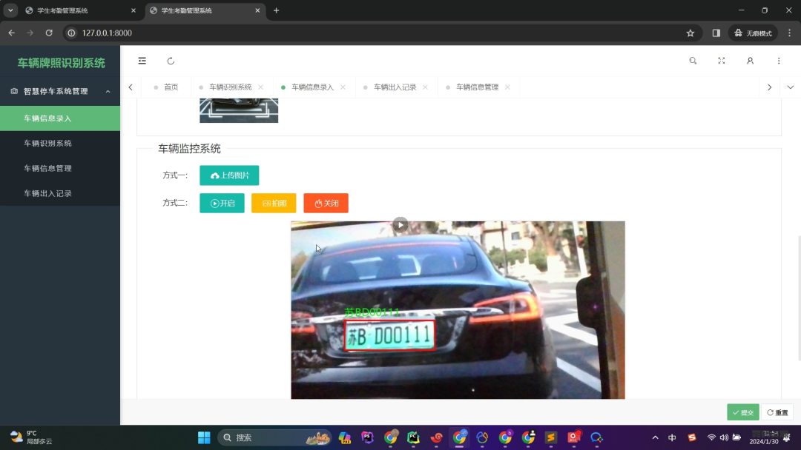
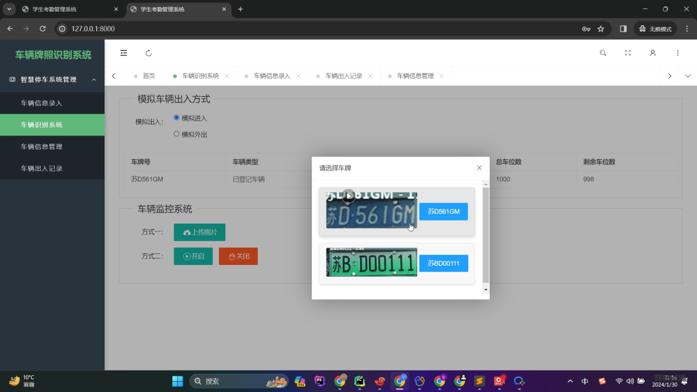

## 项目介绍

### 车牌识别系统 (毕业|学习|研究)

车牌识别系统是一套利用先进的计算机视觉技术和深度学习算法，实现高效、准确车牌识别的系统。适用于停车场、小区出入口等需要实时管理的场景。

### 项目背景

随着城市化进程加快，车辆管理变得日益重要。传统人工管理方式效率低且易出错。车牌识别系统通过技术手段提供高效、可靠的解决方案。

### 项目技术分析

- **计算机视觉与图像处理**：
  - 使用 OpenCV 库进行图像处理和车牌区域提取。
  - 使用 HyperLPR 进行车牌识别，支持多种类型车牌。

- **图像增强**：
  - 提供车牌区域的提取与放大功能，保证图像清晰度和识别精度。

- **Flask 框架**：
  - 使用 Flask 提供图像上传、存储和识别结果的 API 接口。

- **文件存储与数据库交互**：
  - 使用 Flask-Uploads 插件实现图像文件上传与管理。
  - 使用 SQLAlchemy 作为 ORM 框架，将识别后的车牌信息和图像存储到数据库中。

### 项目功能

- 实时车牌识别
- 车牌区域标注
- 车牌图像增强
- 图像上传与存储
- API 接口

### 项目亮点

- 高效准确
- 实时处理
- 易于集成

### 应用场景

- 小区停车管理
- 企业停车场管理
- 公共场所安防

### Venv 安装

```bash
python -m venv venv

# 进入虚拟环境下
pip install -r requirements.txt
```

### 运行项目 

> 如果新增了数据删除调用数据表 `alembic_version` 和 `migrations` 再执行迁移

> 数据库采用 SQLlite

```bash
# 初 始 化 数 据 库
flask db init
flask db migrate
flask db upgrade
flask admin init

# windows改为bat
./run.sh
```

## 命令行启动

```bash
.env\Scripts\Activate.ps1

flask --app app.py run -h 0.0.0.0 -p 8000 --debug
```

> 命令行单个车牌识别

```bash
# 使用命令行测试 - 图像url地址
lpr3 sample -src https://koss.iyong.com/swift/v1/iyong_public/iyong_2596631159095872/image/20190221/1550713902741045679.jpg

# 使用命令行测试 - 本地图像路径
lpr3 sample -src images/test_img.jpg -det high
```

### 开发人员模式

> 账号： admin 密码: a19982421011

> 默认停车场管理员: plate_110 密码: 123456

> 默认在 Linux 环境下使用 `./run.sh` 启动 Flask 自带的 HTTP 服务器，具体你参考以下资源：

---


### 功能截图

- 登录界面
  

- 内部功能截图
  
  
  

### 结语

关注微信公众号“雾码资源”获取更多详细信息和项目源码。关注后即可免费领取最新的AI编程、python学习、算法、大数据、人工智能等资源。欢迎加入我们的学习交流社区！

> 关注微信公众号领取完整源码

